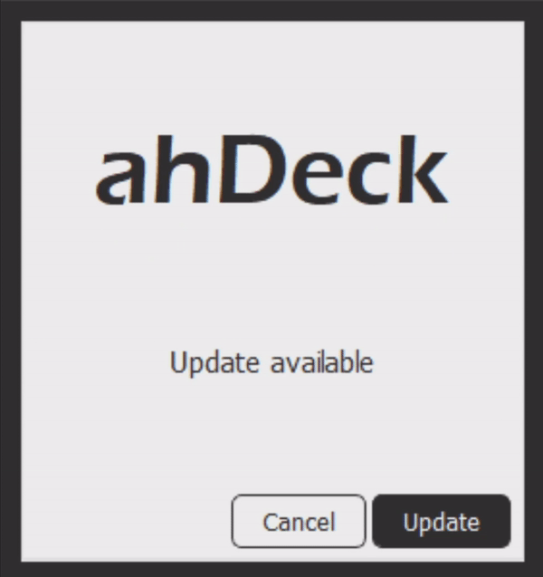
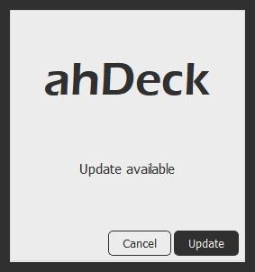
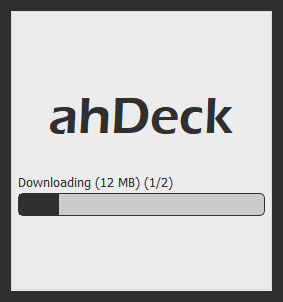

# ahUpdater - Coming Soon
ahUpdater is a software updater to make your application easier to update and commercial ready. It's easy to set up, lightweight, customizable and user friendly.

<table border="0" align="center">
  <tr>
    <td></td>
    <td><br/>
    </td>
  </tr>
</table>

<table border="0" align="center">
  <tr>
    <td><b style="font-size:30px">Features</b></td>
    <td><b style="font-size:30px">Benefits</b></td>
  </tr>
  <tr>
    <td>Check for updates, download, install or unzip</td>
    <td>Make your application more commercial</td>
  </tr>
  <tr>
    <td>Force update option available</td>
    <td>Easier to update your application on the client</td>
  </tr>
  <tr>
    <td>Custom style, custom text, custom icon</td>
 </tr>
 <tr>
    <td>Set package the way you like</td>
 </tr>
</table>

## Table of Contents
- [How to Install](#how-to-install)
- [How to Use](#how-to-use)
- [Copyright and License](#copyright-and-license)

## How to Install
- Download ahUpdater [here](https://google.com)
- Unzip and put the files on your main application directory
- Change the `update.ini` to change the style and the text inside ahUpdater
- Create a `json` file on your server/website with this format :
```json
[
    {
        "app": "",
        "forceUpdate": false,
        "package1": {
            "version": "",
            "url": ""
        },
        "package2": {
            "version": "",
            "url": ""
        },
        "packageN": {
            "version": "",
            "url": ""
        }
    }
]
```
#### A couple things about the json format :
- **app** : The application that will open when the update is finished (parameters/arguments can be used). Example: `mainApplication.exe arg1 arg2 argN` or just `mainApplication.exe`
- **forceUpdate** : If set to false, after ahUpdater checking for updates the user gets to choose between update or cancel. If set to true, the user cannot choose cancel and the system will automatically update.
- **package** : The package can be as many as you like and you can also name it whatever you want to.
- **version** : If you want to update your specific package, make sure the version is higher than your current application version. And vice versa if you don't want some package to be updated, make sure the version is lower or same as your current application version.
- **url** : Is the url to download your new package.

### Examples of Implementation
```json
[
    {
        "app": "mainApplication.exe",
        "forceUpdate": false,
        "package1": {
            "version": "1.1",
            "url": "http://yourwebsite.com/files/mainApplication.exe"
        },
        "package2": {
            "version": "1.1",
            "url": "http://yourwebsite.com/files/package2.zip"
        },
        "packageN": {
            "version": "1.0",
            "url": "http://yourwebsite.com/files/packageN.zip"
        }
    }
]
```

## How to Use
- Call the ahUpdtr.exe with 2 parameters/arguments. The first arguments is your app current version and the second arguments is your json link. Call the ahUpdtr.exe without parent it to your main application, because you need to close your application after calling ahUpdtr.exe in order to update.
```batch
ahUpdtr.exe <your-app-current-version> <your-json-url>

::Example
::ahUpdtr.exe 1.0 http://yourwebsite.com/version.json
```

### Examples of Implementation Using Qt C++
```c++
#include <QProcess>

QProcess *process = new QProcess();
QString program = QCoreApplication::applicationDirPath() + "/ahUpdtr.exe";
QStringList arguments = { your_app_version, your_json_url };
process->start(program, arguments);

close();
```

## Copyright and License
Application and documentation copyright 2021 [ahmadhayyan](https://ahmadhayyan.github.io). ahUpdater released under the [MIT License](LICENSE).
